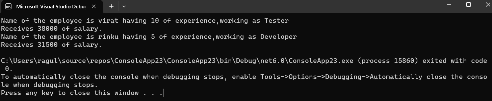

# Ex04-Constructor
## Aim:
 To write a C# program to calculate the salary of an employee by passing the name, designation, noofexperience, basic salary and insurance amount through constructor.
 
 ## Algorithm:
### Step 1:
Import the 'System' namespace to use the classes present in the 'System' namespace.

### Step 2:
Declare the variables with their data type.

### Step 3:
Pass the employee details using constructor.

### Step 4:
Create a function "salary" to calculate the salary of the employee. 1 . hra is 20% of bs 2 . ta is 10% of bs 3 . salary is the sum of hra and ta

### Step 5:
Create a function "display" to display the employee details along with the salary.

### Step 6:
Declare the maon method.

### Step 7:
Assign the emplyee details and call the salary function and display function.

### Step 8:
Run and execute the Program.
 
 
 ## Program:
 ```
 Developed by: Ragul A C
 Register no: 212221240042
 ```
 ```
 using System;
public class Employee
{
   public String designation;
   public String employee_name;
   public int exp;
   public int bs;
   public int insurance;
   double hra, ta, salaryam;

   public Employee(String employee_name, String designation, int exp, int bs, int i)
   {
       this.employee_name = employee_name;
       this.designation = designation;
       this.exp = exp;
       this.bs = bs;
       this.insurance = i;
   }
   public void salary()
   {
       hra = this.bs * 0.2;
       ta = this.bs * 0.1;
       salaryam = this.bs + hra + ta - this.insurance;

   }
   public void display()
   {

       Console.WriteLine("Name of the employee is {0} having {1} of experience,working as {2}", this.employee_name, this.exp, this.designation);
       Console.WriteLine("Receives {0} of salary.", salaryam);

   }

}
class TestEmployee
{
   public static void Main(string[] args)
   {
       Employee e1 = new Employee("virat", "Tester", 10, 30000, 1000);
       e1.salary();
       Employee e2 = new Employee("rinku", "Developer", 5, 25000, 1000);
       e2.salary();
       e1.display();
       e2.display();

   }
}

 ```
 
 ## Output:
 
 
 ## Result:
Thus a a C# program to calculate the salary of an employee by passing the name, designation, noofexperience, basic salary and insurance amount through constructor is written and executed sucessfully.
